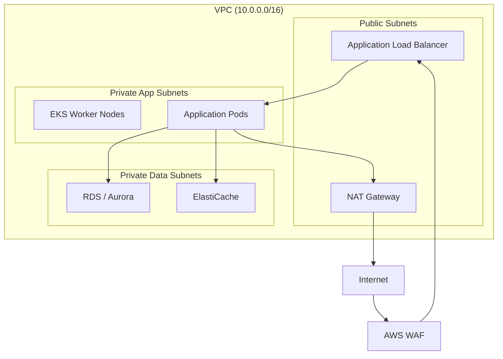
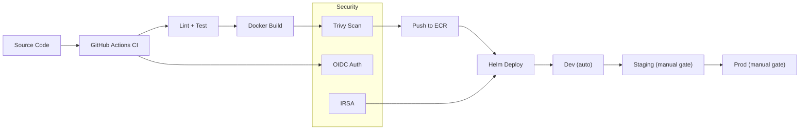
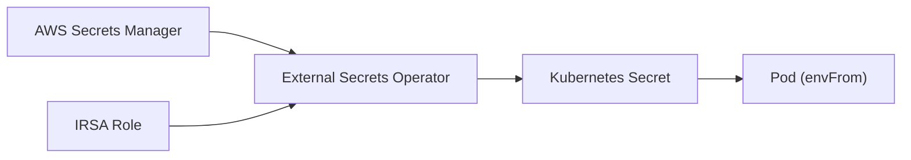

# Golden-Path Platform Architecture

This document describes the architecture, design decisions, and operational patterns behind the golden-path delivery model for applications running on AWS EKS.

---

## 1. Three-Tier Network Architecture

The VPC is divided into three subnet tiers, each spanning three Availability Zones for high availability:



| Tier | Purpose | Internet Access |
|------|---------|-----------------|
| Public | ALB listeners, NAT gateways | Direct (IGW) |
| Private-App | EKS nodes, application pods | Outbound only (via NAT) |
| Private-Data | Databases, caches | None (fully isolated) |

This separation provides network-level blast-radius containment. Even if an application pod is compromised, it cannot directly reach the internet or pivot into the data tier without passing through defined network paths.

---

## 2. Golden-Path Delivery Flow

The golden path provides a paved road from source code to production. Teams fork or reference the shared Helm chart and CI/CD workflow rather than building their own.



**Key stages:**

1. **Lint** -- golangci-lint catches code quality and style issues before tests run.
2. **Test** -- Unit tests with race detection and coverage reporting.
3. **Build** -- Multi-stage Docker build produces a minimal distroless image.
4. **Scan** -- Trivy scans the image for CRITICAL/HIGH CVEs and fails the pipeline if any are found.
5. **Push** -- The image is pushed to ECR with an immutable tag (Git SHA).
6. **Deploy** -- Helm upgrade/install with environment-specific value overrides.
   - Dev deploys automatically on merge to main.
   - Staging and production require manual approval via GitHub Environments.

---

## 3. Base Image Strategy

The Dockerfile uses a two-stage build:

| Stage | Image | Purpose |
|-------|-------|---------|
| Build | `golang:1.22-alpine` | Compile the Go binary with CGO disabled for a fully static binary |
| Runtime | `gcr.io/distroless/static-debian12:nonroot` | Run the binary with minimal attack surface |

**Why distroless?**

- No shell, no package manager, no libc -- attackers have no tools if they gain code execution.
- The `nonroot` tag runs as UID 65532 by default, which matches the Kubernetes securityContext.
- Image size is approximately 2 MB (base) + binary, keeping pull times and storage costs low.
- Trivy scans produce fewer false positives because there are fewer OS packages to evaluate.

---

## 4. Secret Management

Secrets follow a zero-trust path from AWS Secrets Manager into pods:



1. **AWS Secrets Manager** is the single source of truth for all application secrets.
2. **External Secrets Operator (ESO)** runs in-cluster and uses IRSA to authenticate to AWS.
3. ESO creates and continuously refreshes a Kubernetes Secret (default: every 1 hour).
4. The pod mounts the Secret via `envFrom`, making individual keys available as environment variables.

**Why this pattern?**

- Secrets never appear in Git, Helm values, or CI/CD logs.
- IRSA scopes the ESO's IAM permissions to only the secrets it needs (least privilege).
- The refresh interval means rotated secrets propagate automatically without redeployment.
- The ExternalSecret CRD is version-controlled alongside the Helm chart, so secret references are auditable.

---

## 5. Autoscaling Strategy

Autoscaling operates at two layers:

### 5a. Pod-Level: Horizontal Pod Autoscaler (HPA)

The HPA watches CPU and memory utilization and adjusts the replica count accordingly.

| Parameter | Dev | Staging | Prod |
|-----------|-----|---------|------|
| Min replicas | 1 (HPA off) | 2 | 3 |
| Max replicas | -- | 5 | 20 |
| CPU target | -- | 70% | 60% |
| Scale-down window | -- | 300s | 600s |

Production uses a slower scale-down window (600s) to avoid flapping during transient load dips, and a faster scale-up window (15s) to respond quickly to traffic spikes.

### 5b. Node-Level: Karpenter

When the HPA creates pods that cannot be scheduled (insufficient node capacity), Karpenter provisions right-sized EC2 instances within seconds.

- **Instance selection**: Karpenter chooses from c/m/r family instances (generation 5+) to balance compute, memory, and cost.
- **Capacity type**: Production uses on-demand only for stability; dev/staging allow spot instances for cost savings.
- **Consolidation**: Karpenter automatically consolidates underutilised nodes, removing them when pods can fit on fewer nodes.
- **Node rotation**: Nodes expire after 30 days (`expireAfter: 720h`) to ensure they pick up the latest AMI and patches.

---

## 6. WAF and Ingress Pattern

Traffic flows through three layers of protection:

```
Internet --> AWS WAF --> ALB (via Ingress) --> ClusterIP Service --> Pod
```

**AWS WAF** provides:
- Rate limiting (2000 requests per 5 minutes per IP).
- AWS Managed Rule Groups: Common Rule Set (OWASP Top 10), Known Bad Inputs, SQL Injection.
- All rules emit CloudWatch metrics for visibility.

**ALB Ingress Controller** manages:
- TLS termination at the ALB (HTTPS only, HTTP redirects to 443).
- IP-mode target groups for direct pod routing (no extra hop through NodePort).
- Health checks against `/health` with configurable thresholds.

The WAF WebACL ARN is passed to the ALB via the `alb.ingress.kubernetes.io/wafv2-acl-arn` annotation, which the ALB Ingress Controller reads to associate the WebACL with the load balancer.

WAF is disabled in dev (no cost, faster iteration) and enabled in staging and production.

---

## 7. How Teams Adopt the Golden Path

The golden path is designed as a reusable template, not a monolith:

1. **Fork the Helm chart** -- Teams copy `infra/helm/golden-path/` into their repo and customise `values-{env}.yaml` for their application's resource needs, domain names, and secrets.

2. **Reference the CI/CD workflow** -- The GitHub Actions workflow supports `workflow_call`, so teams can call it from their own `.github/workflows/` without duplicating pipeline logic:

   ```yaml
   jobs:
     deploy:
       uses: maltego/golden-path-platform/.github/workflows/ci-cd.yaml@main
       with:
         environment: prod
   ```

3. **Platform team maintains the base** -- Updates to the Helm chart, Dockerfile pattern, or CI/CD pipeline flow through the shared repository. Teams pull updates at their own pace.

4. **Guardrails are built in** -- The NetworkPolicy, securityContext, and Trivy scan are part of the default chart, so teams get security-by-default without extra effort.

---

## 8. Assumptions and Tradeoffs

### Assumptions

- **Single AWS account per environment** -- The Terraform and CI/CD pipeline assume separate AWS accounts (or at minimum, separate EKS clusters) for dev, staging, and production.
- **GitHub Actions as CI/CD** -- The pipeline is GitHub-native. Migrating to GitLab CI or Jenkins would require rewriting the workflow but not the Helm/Terraform layers.
- **External Secrets Operator is pre-installed** -- The ClusterSecretStore (`aws-secrets-manager`) and the ESO itself are assumed to be managed by the platform team outside this chart.
- **ALB Ingress Controller is pre-installed** -- The `alb` IngressClass and its controller are cluster-level concerns, not per-app.
- **Prometheus Operator is pre-installed** -- The ServiceMonitor CRD requires the Prometheus Operator (typically via kube-prometheus-stack).

### Tradeoffs

| Decision | Benefit | Cost |
|----------|---------|------|
| Distroless runtime image | Minimal attack surface, small image | No shell for debugging; must use `kubectl debug` or ephemeral containers |
| IRSA over node-level IAM | Least-privilege per pod | More IAM roles to manage |
| Karpenter over Cluster Autoscaler | Faster provisioning, better bin-packing | Newer project, less battle-tested in some edge cases |
| Single Helm chart for all envs | Consistency across environments | Teams with unusual requirements may need to fork heavily |
| WAF at ALB level | Centralised protection, no app code changes | Per-request cost; rules must be tuned to avoid false positives |
| Immutable ECR tags | Auditability, reproducible deployments | Cannot overwrite tags; requires cleanup policy |

---

## 9. What I Would Do Next

Given more time, the following improvements would strengthen the platform:

1. **GitOps with ArgoCD or Flux** -- Replace the `helm upgrade` in CI/CD with a GitOps operator that watches a Git repo for desired state. This provides drift detection, automatic rollback, and a single audit log.

2. **Pod Disruption Budgets (PDB)** -- Add a PDB template to the Helm chart to ensure rolling updates and node drains never take all replicas offline simultaneously.

3. **Canary/progressive deployments** -- Integrate Argo Rollouts or Flagger for canary or blue-green deployments with automatic rollback based on error rate and latency metrics.

4. **Centralised logging** -- Deploy Fluent Bit as a DaemonSet to ship structured JSON logs to CloudWatch Logs or an ELK/Loki stack.

5. **Cost controls** -- Add Kubecost or AWS Cost Explorer dashboards, and tag all resources with `team` and `service` for chargeback.

6. **Policy engine** -- Deploy OPA Gatekeeper or Kyverno with policies that enforce the golden-path standards (e.g. "all pods must have resource limits", "no containers running as root").

7. **Multi-region / DR** -- Extend the Terraform to support a standby region with Route 53 health-check-based failover.

8. **Helm chart testing** -- Add `helm unittest` or `ct lint-and-install` to the CI pipeline to validate chart rendering before deployment.

9. **Supply chain security** -- Sign container images with Cosign and verify signatures in the admission controller before allowing pods to start.

10. **Terraform modules** -- Break the monolithic `main.tf` into reusable modules (vpc, eks, waf, ecr) published to a private module registry.
