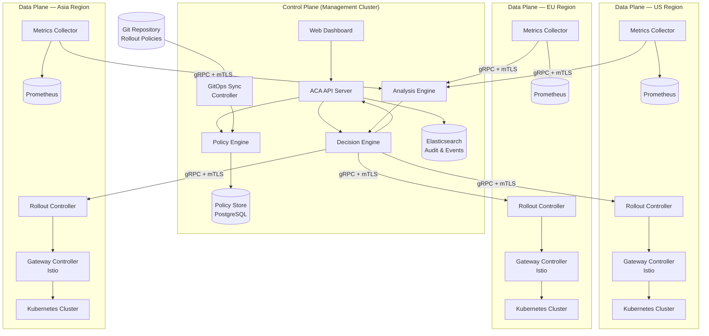
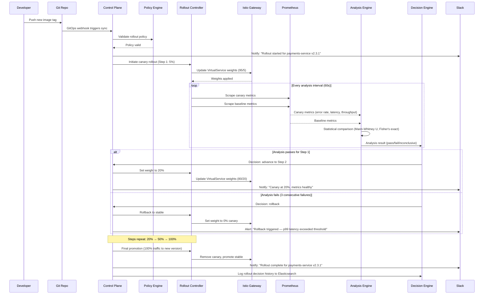
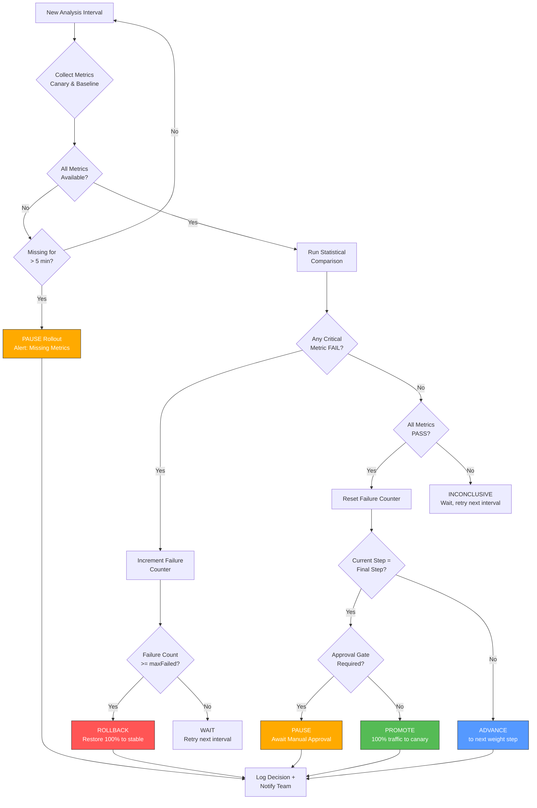
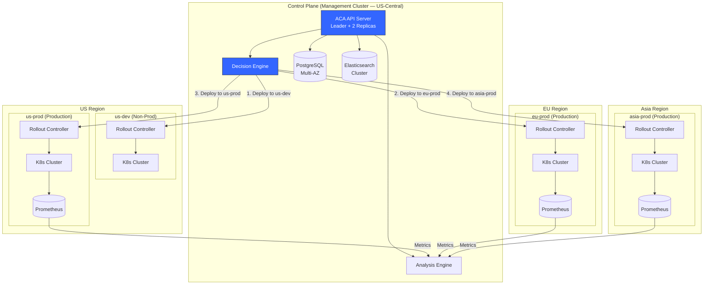

# Centralized Automated Canary Analysis (ACA) System Design

## Table of Contents

1. [Executive Summary](#1-executive-summary)
2. [Architecture Overview](#2-architecture-overview)
3. [Onboarding Application Teams](#3-onboarding-application-teams)
4. [Rollout Policy Definition, Storage, and Enforcement](#4-rollout-policy-definition-storage-and-enforcement)
5. [Canary Traffic Routing and Measurement](#5-canary-traffic-routing-and-measurement)
6. [Rollout Decision Logic](#6-rollout-decision-logic)
7. [Observability — ELK Stack Integration](#7-observability--elk-stack-integration)
8. [Control-Plane vs Data-Plane Boundaries](#8-control-plane-vs-data-plane-boundaries)
9. [Multi-Region Deployment and Partial Regional Failures](#9-multi-region-deployment-and-partial-regional-failures)
10. [High Availability and Failure Isolation](#10-high-availability-and-failure-isolation)
11. [Security, Compliance, Tenancy, and Access Control](#11-security-compliance-tenancy-and-access-control)
12. [Service Owner Interaction During Rollout and Incidents](#12-service-owner-interaction-during-rollout-and-incidents)
13. [Operational Model for Auditability and Supportability](#13-operational-model-for-auditability-and-supportability)
14. [Optional: AI/LLM-Assisted Capabilities](#14-optional-aillm-assisted-capabilities)
15. [Phased Rollout Plan (MVP to Scale)](#15-phased-rollout-plan-mvp-to-scale)
16. [Key Risks and Tradeoffs](#16-key-risks-and-tradeoffs)
17. [Assumptions](#17-assumptions)
18. [Cost Model](#18-cost-model)

---

## 1. Executive Summary

### Problem

The organization operates 500+ microservices across Kubernetes clusters spanning three geographic regions (US, EU, Asia). Today, deployments are manual, full-traffic rollouts that frequently cause production incidents. There is no systematic way to validate a new version under real traffic before committing to a full release, and rollbacks are slow, manual, and error-prone.

### Proposed Solution

Design and implement a **Centralized Automated Canary Analysis (ACA) system** that provides safe, progressive deployments with automated rollback. The system will:

- **Gradually shift traffic** to new versions (canary releases) while monitoring key health metrics.
- **Automatically compare** canary performance against a stable baseline using statistical analysis.
- **Decide autonomously** to promote, pause, or roll back a deployment based on configurable policies.
- **Operate across all three regions** with independent failure domains and centralized governance.
- **Provide self-service onboarding** so that any of the 500+ service teams can adopt safe deployments with minimal effort.

The expected outcome is a reduction of deployment-related incidents by 80%+, deployment lead time reduced from hours to minutes, and full auditability of every release decision.

---

## 2. Architecture Overview

### Design Principles

- **Control Plane / Data Plane Separation**: Centralized decision-making with distributed execution.
- **GitOps-driven**: All rollout policies and configurations stored in Git as the source of truth.
- **Fail-safe by default**: If the system cannot determine health, it pauses rather than promotes.
- **Self-service**: Teams onboard without filing tickets or waiting on a platform team.

### Core Components

| Component | Location | Responsibility |
|---|---|---|
| **Policy Engine** | Control Plane | Validates and stores rollout policies |
| **Analysis Engine** | Control Plane | Compares canary vs baseline metrics using statistical methods |
| **Decision Engine** | Control Plane | Determines promote/pause/rollback based on analysis results |
| **Rollout Controller** | Data Plane (per region) | Executes traffic shifts and manages local rollout state |
| **Metrics Collector** | Data Plane (per region) | Gathers Prometheus metrics from canary and baseline pods |
| **Gateway Controller** | Data Plane (per region) | Manages Istio VirtualService for traffic splitting |

### High-Level Architecture Diagram



---

## 3. Onboarding Application Teams

### Self-Service Onboarding Flow

Onboarding is designed to be frictionless. A team can go from zero to canary deployments in under 30 minutes.

**Step 1: Register the service** via CLI or web portal.

```bash
aca-cli service register \
  --name payments-service \
  --namespace payments \
  --team payments-team \
  --slack-channel "#payments-deploys" \
  --regions us,eu,asia
```

**Step 2: Apply a RolloutPolicy CRD** to the service's namespace. Teams can use the defaults or customize.

**Step 3: Deploy as usual.** The ACA system detects new image tags and initiates the canary process automatically.

### RolloutPolicy CRD (Custom Resource Definition)

```yaml
apiVersion: aca.internal.io/v1alpha1
kind: RolloutPolicy
metadata:
  name: payments-service-policy
  namespace: payments
  labels:
    team: payments-team
    tier: critical
spec:
  # Service selector
  targetRef:
    apiVersion: apps/v1
    kind: Deployment
    name: payments-service

  # Rollout strategy
  strategy:
    canary:
      steps:
        - setWeight: 5
          pause: { duration: 5m }
        - setWeight: 20
          pause: { duration: 10m }
        - setWeight: 50
          pause: { duration: 15m }
        - setWeight: 100

      # Analysis configuration
      analysis:
        interval: 60s
        metrics:
          - name: error-rate
            threshold:
              maxValue: 0.01    # 1% error rate
            provider: prometheus
            query: |
              sum(rate(http_requests_total{service="payments-service",
                status=~"5.."}[2m]))
              /
              sum(rate(http_requests_total{service="payments-service"}[2m]))

          - name: p99-latency
            threshold:
              maxValue: 500      # 500ms
            provider: prometheus
            query: |
              histogram_quantile(0.99,
                sum(rate(http_request_duration_seconds_bucket{
                  service="payments-service"}[2m])) by (le))

          - name: throughput-deviation
            threshold:
              maxDeviation: 10   # 10% deviation from baseline
            provider: prometheus

      # Rollback configuration
      rollback:
        autoRollback: true
        maxFailedAnalyses: 3
        rollbackWindow: 300s

  # Regional configuration
  regions:
    order: [us-dev, eu-prod, us-prod, asia-prod]
    pauseBetweenRegions: true
    requireApproval:
      - us-prod
      - asia-prod

  # Notification preferences
  notifications:
    slack:
      channel: "#payments-deploys"
      events: [rollout.started, analysis.failed, rollout.complete, rollback.triggered]
    pagerduty:
      serviceKey: "pd-payments-key-ref"
      events: [rollback.triggered, rollout.aborted]
```

### Sane Defaults

If a team applies a minimal `RolloutPolicy` without specifying details, the system applies the following defaults:

| Parameter | Default Value |
|---|---|
| Canary steps | 5% → 20% → 50% → 100% |
| Pause between steps | 5 minutes |
| Error rate threshold | < 1% |
| Latency threshold (p99) | < 2x baseline |
| Max failed analyses before rollback | 3 |
| Auto-rollback | Enabled |
| Regional order | Sequential (US → EU → Asia) |

---

## 4. Rollout Policy Definition, Storage, and Enforcement

### GitOps Storage

All rollout policies are stored in a Git repository with the following structure:

```
rollout-policies/
  payments/
    payments-service.yaml
    refund-service.yaml
  auth/
    auth-service.yaml
    token-service.yaml
  ...
```

Changes to policies go through pull request review. Merging to `main` triggers the GitSync controller to reconcile policies in the cluster.

### Admission Webhook Enforcement

A ValidatingAdmissionWebhook validates every `RolloutPolicy` before it is persisted:

- **Schema validation**: All required fields are present and correctly typed.
- **Threshold validation**: Error rate thresholds are within sane bounds (e.g., not > 50%).
- **Step validation**: Traffic weight steps are monotonically increasing and end at 100.
- **Query validation**: Prometheus queries are syntactically valid.
- **RBAC validation**: The submitting user has permission to modify the policy for this namespace.
- **Cross-reference validation**: The target Deployment exists in the namespace.

Rejected policies return a clear error message:

```
Error: RolloutPolicy "payments-service-policy" is invalid:
  spec.strategy.canary.steps: steps must end with setWeight: 100
  spec.strategy.canary.analysis.metrics[0].threshold.maxValue: must be between 0 and 1 for error-rate metric
```

### Policy Versioning

Every policy change is versioned. The system maintains a history of policy versions so that any rollout can be attributed to the exact policy in effect at the time.

---

## 5. Canary Traffic Routing and Measurement

### Traffic Splitting with Istio

The Gateway Controller manages Istio `VirtualService` resources to split traffic between the stable and canary versions.

```yaml
apiVersion: networking.istio.io/v1beta1
kind: VirtualService
metadata:
  name: payments-service
  namespace: payments
spec:
  hosts:
    - payments-service.payments.svc.cluster.local
  http:
    - route:
        - destination:
            host: payments-service-stable
            port:
              number: 8080
          weight: 95
        - destination:
            host: payments-service-canary
            port:
              number: 8080
          weight: 5
```

As the rollout progresses, the controller updates the weights according to the policy steps (5 → 20 → 50 → 100).

### Metrics Collection

The Metrics Collector gathers four categories of signals:

| Metric Category | Specific Metrics | Source |
|---|---|---|
| **Error Rate** | HTTP 5xx ratio, gRPC error ratio | Istio telemetry via Prometheus |
| **Latency** | p50, p95, p99 response time | Istio telemetry via Prometheus |
| **Throughput** | Requests per second | Istio telemetry via Prometheus |
| **Saturation** | CPU utilization, memory utilization, pod restarts | Kubernetes metrics via Prometheus |

### Baseline vs Canary Comparison

The Analysis Engine compares canary metrics against the **live baseline** (the stable version receiving production traffic simultaneously). This is superior to comparing against historical data because:

- It accounts for time-of-day traffic patterns.
- It accounts for upstream dependency changes.
- It provides a contemporaneous control group.

The comparison uses the **Mann-Whitney U test** for latency distributions and **Fisher's exact test** for error rate proportions, with a configurable significance level (default: p < 0.05).

### Rollout Sequence Diagram



---

## 6. Rollout Decision Logic

### State Machine

Every rollout moves through a well-defined set of states:

| State | Description |
|---|---|
| `Init` | Rollout created; canary pods are being scheduled |
| `Canary` | Traffic is being shifted to canary according to current step |
| `Analyzing` | Analysis Engine is comparing canary vs baseline metrics |
| `Promoting` | Analysis passed; advancing to the next step or final promotion |
| `RollingBack` | Analysis failed; reverting traffic to stable |
| `Paused` | Rollout paused (manual intervention or awaiting approval gate) |
| `Complete` | Rollout successfully completed; canary is now stable |
| `Aborted` | Rollout terminated due to critical failure or manual abort |

### Decision Criteria

At each analysis interval, the Decision Engine evaluates:

1. **Error rate comparison**: Is the canary error rate statistically significantly higher than the baseline?
2. **Latency comparison**: Are p50/p95/p99 latencies significantly degraded compared to baseline?
3. **Throughput check**: Is the canary handling its proportional share of traffic?
4. **Saturation check**: Are canary pods consuming excessive CPU/memory or restarting?

Each criterion produces a verdict: `Pass`, `Fail`, or `Inconclusive`.

**Decision Rules:**
- If any critical metric is `Fail` → increment failure counter.
- If failure counter >= `maxFailedAnalyses` (default: 3) → **Rollback**.
- If all metrics are `Pass` → reset failure counter, **Advance** to next step.
- If any metric is `Inconclusive` and none are `Fail` → **Wait** (do not advance or rollback).

### Manual Override

Service owners and platform engineers can override the automated decision at any time:

```bash
# Force promotion (skip remaining analysis)
aca-cli rollout promote payments-service --force --reason "Hotfix for critical bug"

# Force rollback
aca-cli rollout rollback payments-service --reason "Customer-reported issue"

# Pause rollout
aca-cli rollout pause payments-service --reason "Investigating anomaly"

# Resume rollout
aca-cli rollout resume payments-service
```

All manual overrides are logged with the operator's identity and stated reason.

### Decision Engine Flowchart



---

## 7. Observability — ELK Stack Integration

### Structured Rollout Events

Every rollout action emits a structured JSON event to Elasticsearch:

```json
{
  "@timestamp": "2026-03-30T14:23:01Z",
  "event.type": "rollout.step.advanced",
  "service.name": "payments-service",
  "service.namespace": "payments",
  "service.version": "v2.3.1",
  "rollout.id": "roll-abc123",
  "rollout.step": 2,
  "rollout.canary_weight": 20,
  "rollout.region": "us-prod",
  "analysis.error_rate.canary": 0.003,
  "analysis.error_rate.baseline": 0.004,
  "analysis.p99_latency.canary_ms": 245,
  "analysis.p99_latency.baseline_ms": 238,
  "analysis.verdict": "pass",
  "decision": "advance",
  "decision.reason": "All metrics within threshold for 3 consecutive intervals",
  "actor": "system/decision-engine"
}
```

### Event Types

| Event Type | When Emitted |
|---|---|
| `rollout.started` | Rollout initiated |
| `rollout.step.advanced` | Traffic weight increased to next step |
| `rollout.analysis.passed` | Analysis interval result: healthy |
| `rollout.analysis.failed` | Analysis interval result: degraded |
| `rollout.analysis.inconclusive` | Analysis interval result: insufficient data |
| `rollout.paused` | Rollout paused (automatic or manual) |
| `rollout.resumed` | Rollout resumed |
| `rollout.rollback.triggered` | Automated rollback initiated |
| `rollout.rollback.complete` | Rollback finished |
| `rollout.promoted` | Canary promoted to stable |
| `rollout.aborted` | Rollout terminated manually |
| `rollout.override` | Manual override applied |

### Kibana Dashboards

Three primary dashboards:

1. **Fleet Overview**: Real-time view of all active rollouts across all regions, color-coded by status (green = healthy, yellow = analyzing, red = rolling back).
2. **Service Rollout Detail**: Drill-down for a specific service showing canary vs baseline metrics over time, step transitions, and decision log.
3. **Rollout History & Trends**: Historical success/failure rates, mean time to deploy, most common rollback reasons.

### Metrics Pipeline

```
Prometheus (per region)
    → Metrics Collector (gRPC)
    → Analysis Engine (control plane)
    → Decision events → Elasticsearch
    → Kibana dashboards

Prometheus (per region)
    → Prometheus Federation (optional)
    → Grafana (real-time operational dashboards)
```

Both Grafana (for real-time operational monitoring) and Kibana (for rollout event analysis and audit trails) are used. They serve complementary purposes.

---

## 8. Control-Plane vs Data-Plane Boundaries

### Responsibility Matrix

| Concern | Control Plane | Data Plane |
|---|---|---|
| Policy management | Stores, validates, versions policies | Caches active policy locally |
| Rollout decisions | Makes promote/rollback/pause decisions | Executes decisions |
| Traffic routing | Sends routing commands | Manages Istio VirtualService |
| Metric collection | Receives aggregated metrics for analysis | Scrapes Prometheus, aggregates locally |
| Dashboard & API | Serves UI and REST API | N/A |
| Audit log | Writes all events to Elasticsearch | Buffers events locally, forwards to CP |
| User interaction | CLI/portal/Slack integration | N/A |

### Communication Protocol

- **Protocol**: gRPC with Protocol Buffers for all control-plane to data-plane communication.
- **Security**: Mutual TLS (mTLS) with certificate rotation via cert-manager.
- **Reliability**: gRPC retries with exponential backoff; circuit breaker after 5 consecutive failures.

### Data Plane Autonomy (Fail-Safe)

If the data plane **loses connectivity** to the control plane:

1. **Active rollouts pause** at the current step. No further traffic shifts occur.
2. The data plane continues to collect metrics and buffer them locally.
3. If a canary is actively failing health checks, the data plane can execute a **local rollback** based on the cached policy's rollback rules.
4. When connectivity is restored, the data plane syncs its state and buffered metrics back to the control plane.

This fail-safe design ensures that a control plane outage never results in an unmonitored canary receiving more traffic.

---

## 9. Multi-Region Deployment and Partial Regional Failures

### Regional Rollout Ordering

Deployments roll out sequentially across regions in a configurable order. A typical pattern:

1. **us-dev** (non-production, smoke test)
2. **eu-prod** (lower traffic region, production validation)
3. **us-prod** (highest traffic region)
4. **asia-prod** (final region)

Each region completes its full canary analysis before the next region begins. Teams can configure approval gates between regions.

### Independent Failure Domains

Each region operates as an independent failure domain:

- Regional Rollout Controllers manage local state.
- Regional Prometheus instances collect local metrics.
- Regional Istio gateways manage local traffic.

A failure in one region does not affect deployments in other regions.

### Partial Failure Handling

| Scenario | Action |
|---|---|
| Canary fails in EU, healthy in US | Rollback in EU, pause US rollout, notify team |
| Control plane unreachable from Asia | Pause Asia rollout, continue US/EU normally |
| Prometheus down in US | Pause US rollout (no metrics = no promotion), continue EU/Asia |
| Network partition between regions | Each region operates autonomously using cached policy |

### Multi-Region Topology Diagram



---

## 10. High Availability and Failure Isolation

### Control Plane HA

| Component | HA Strategy |
|---|---|
| ACA API Server | 3 replicas across AZs; Kubernetes Service load balancing |
| Decision Engine | Active/standby with leader election (Kubernetes Lease API) |
| PostgreSQL | Multi-AZ managed service (e.g., AWS RDS or Cloud SQL) with automated failover |
| Elasticsearch | 3-node cluster across AZs with index replication |
| GitSync Controller | Single active with leader election; idempotent reconciliation |

### Data Plane Resilience

- **Local state cache**: Each Rollout Controller maintains an in-memory + on-disk cache of its active rollout state and the governing policy. If the control plane is unreachable, the controller operates from this cache.
- **Metrics buffering**: If the control plane cannot receive metrics, the Metrics Collector buffers up to 1 hour of data locally and replays it upon reconnection.
- **Istio independence**: Istio VirtualService configurations are persisted in the local Kubernetes API server. Even if both the control plane and the Rollout Controller are unavailable, existing traffic routing remains stable.

### Circuit Breaker Pattern

Inter-region and control-plane-to-data-plane calls use a circuit breaker:

- **Closed** (normal): Requests flow through.
- **Open** (after 5 consecutive failures or > 50% error rate in 30s window): Requests are short-circuited; data plane enters autonomous mode.
- **Half-open** (after 30s cooldown): A single probe request is sent. If it succeeds, the circuit closes.

### Graceful Degradation

| Failure Scenario | System Behavior |
|---|---|
| Control plane leader lost | Standby promotes within 15s; in-flight rollouts pause until new leader syncs state |
| PostgreSQL failover | 10-30s downtime; API returns 503; rollouts pause; no data loss |
| Elasticsearch unavailable | Rollouts continue; events buffered locally; dashboards degraded |
| Single data plane region offline | Other regions unaffected; offline region rollouts paused |
| Full control plane outage | All rollouts pause globally; no unsafe promotions; data planes cache state |

---

## 11. Security, Compliance, Tenancy, and Access Control

### RBAC Model

```
Platform Admin
  └── Full access to all rollout policies, overrides, and system configuration

Team Lead (per namespace)
  └── Create/modify rollout policies for their namespace
  └── Approve production rollouts
  └── Trigger manual rollback

Developer (per namespace)
  └── View rollout status for their namespace
  └── Trigger rollout (deploy new version)
  └── View metrics and logs

Auditor (read-only)
  └── View all rollout history and decisions
  └── Export audit logs
  └── No write access
```

RBAC is enforced via Kubernetes RBAC (for CRD operations) and the ACA API Server (for dashboard and CLI operations). Identity is sourced from the organization's SSO/OIDC provider.

### Namespace-Based Tenant Isolation

- Each team's services live in dedicated Kubernetes namespaces.
- RolloutPolicy CRDs are namespace-scoped: a team can only create policies for Deployments in their own namespace.
- Metrics queries are scoped by namespace labels to prevent cross-tenant data access.
- Network policies restrict data-plane pods from communicating across namespace boundaries.

### Audit Logging for Compliance

Every action is logged with:

- **Who**: Authenticated user identity (from OIDC token).
- **What**: Action performed (create policy, trigger rollout, approve promotion, force rollback).
- **When**: Timestamp (UTC).
- **Where**: Cluster, namespace, region.
- **Why**: Stated reason (required for manual overrides).
- **Outcome**: Success or failure.

Audit logs are stored in Elasticsearch with a **13-month retention policy** (to cover SOC2 annual audit window) and are immutable (append-only index with no delete API exposed).

**SOC2 Compliance**: The audit trail demonstrates that every production change goes through a controlled, reviewable process with separation of duties (developer deploys, system validates, lead approves).

**ISO 27001 Compliance**: Change management records show risk assessment (canary analysis), authorization (approval gates), and rollback capability.

### mTLS and Network Security

- All gRPC communication between control plane and data planes uses mTLS with certificates issued by an internal CA (cert-manager with Vault backend).
- Certificates rotate automatically every 24 hours.
- Istio's mesh-wide mTLS encrypts all in-cluster service-to-service traffic.
- No secrets (API keys, database credentials, PagerDuty tokens) are stored in RolloutPolicy CRDs. Secrets are referenced by name and resolved from Kubernetes Secrets or an external secret manager (e.g., HashiCorp Vault).

---

## 12. Service Owner Interaction During Rollout and Incidents

### Notification Flow

```
Rollout Started
  → Slack: "#payments-deploys: Rollout started for payments-service v2.3.1 in us-dev"

Canary Step Advanced
  → Slack: "#payments-deploys: Canary at 20%, all metrics healthy (error rate: 0.3%, p99: 245ms)"

Approval Gate Reached
  → Slack: "#payments-deploys: Awaiting approval for us-prod deployment. Approve: aca-cli rollout approve payments-service"

Analysis Failed
  → Slack: "#payments-deploys: WARNING — Canary analysis failed (p99 latency 890ms > 500ms threshold). Failure 1/3."

Rollback Triggered
  → Slack: "#payments-deploys: ROLLBACK triggered for payments-service v2.3.1. Reason: 3 consecutive analysis failures."
  → PagerDuty: Alert created for payments-service on-call

Rollout Complete
  → Slack: "#payments-deploys: Rollout complete for payments-service v2.3.1 across all regions. Duration: 47m."
```

### Manual Approval Gates

For critical services, production rollouts require manual approval:

1. The system pauses at the configured gate and sends a Slack notification.
2. The team lead reviews canary metrics on the dashboard.
3. Approval is granted via CLI or dashboard button:
   ```bash
   aca-cli rollout approve payments-service --region us-prod
   ```
4. The approval is logged with the approver's identity.

### Emergency Rollback

In case of incidents detected outside the canary analysis (e.g., customer reports, downstream failures):

```bash
# Immediate rollback across all regions
aca-cli rollout rollback payments-service --all-regions --reason "Customer-reported payment failures"

# Rollback in a specific region
aca-cli rollout rollback payments-service --region eu-prod --reason "EU latency spike"
```

The dashboard also provides a one-click rollback button with confirmation dialog.

### PagerDuty Integration

- Failed canary analyses that trigger automatic rollback create a PagerDuty incident.
- The incident includes: service name, version, failure reason, rollback status, and a link to the rollout dashboard.
- Incidents are auto-resolved when the rollback completes successfully.

---

## 13. Operational Model for Auditability and Supportability

### Decision Logging

Every decision made by the Decision Engine is logged with full reasoning:

```json
{
  "decision_id": "dec-789xyz",
  "rollout_id": "roll-abc123",
  "timestamp": "2026-03-30T14:23:01Z",
  "decision": "advance",
  "reason": "All 4 metrics passed for 3 consecutive intervals at 5% canary weight",
  "metrics_snapshot": {
    "error_rate": { "canary": 0.003, "baseline": 0.004, "verdict": "pass", "p_value": 0.72 },
    "p99_latency_ms": { "canary": 245, "baseline": 238, "verdict": "pass", "p_value": 0.31 },
    "throughput_rps": { "canary": 12.5, "baseline": 237.5, "verdict": "pass", "deviation": "0.2%" },
    "cpu_utilization": { "canary": 0.35, "baseline": 0.33, "verdict": "pass" }
  },
  "policy_version": "v3",
  "actor": "system/decision-engine"
}
```

### Rollout History API

```bash
# Query rollout history for a service
aca-cli rollout history payments-service --limit 20

# Get details of a specific rollout
aca-cli rollout describe roll-abc123

# Export rollout history as JSON for compliance audits
aca-cli rollout export --service payments-service --from 2026-01-01 --to 2026-03-30 --format json
```

### Runbooks for Common Failure Scenarios

| Scenario | Runbook |
|---|---|
| Canary rollback due to high error rate | Check error logs for canary pods; verify dependency health; review code changes in the release |
| Canary rollback due to high latency | Check resource utilization; verify database query performance; review for N+1 queries |
| Rollout stuck in "Analyzing" | Check Prometheus health; verify metrics are being scraped; check network connectivity to control plane |
| Control plane unreachable | Check management cluster health; verify network policies; check certificate expiry |
| Rollout policy rejected by webhook | Review validation error message; fix policy YAML; re-submit PR |

### SLOs

| SLO | Target | Measurement |
|---|---|---|
| Rollout completion success rate | 99.9% | Rollouts that complete without system error (policy-triggered rollbacks are not failures) |
| Time to rollback | < 60 seconds | From rollback decision to traffic fully shifted back to stable |
| Control plane availability | 99.95% | API server responding to health checks |
| Decision latency | < 5 seconds | Time from metrics received to decision emitted |
| Audit log completeness | 100% | Every rollout action has a corresponding audit event |

---

## 14. Optional: AI/LLM-Assisted Capabilities

### Anomaly Detection with ML

Train ML models on historical rollout metrics to detect anomalies that statistical tests might miss:

- **Time-series anomaly detection**: LSTM or Prophet models trained on per-service metric history to detect unusual patterns (e.g., slow memory leak that does not trigger threshold-based alerts).
- **Multi-variate anomaly detection**: Detect correlated anomalies across metrics (e.g., throughput drops while latency rises, indicating saturation).
- **Baseline drift detection**: Alert when baseline metrics shift significantly over time, indicating the need to update thresholds.

### Natural Language Rollout Queries

Integrate an LLM interface (via Slack bot or dashboard chat) for natural language queries:

- "Is the payments-service deploy healthy?"
- "What caused the last rollback for auth-service?"
- "Show me all failed deployments in EU this week."
- "Compare error rates between v2.3.0 and v2.3.1."

The LLM translates natural language queries into API calls against the rollout history and metrics stores.

### Auto-Generated Incident Summaries

When a rollback is triggered, automatically generate a structured incident summary:

```
INCIDENT SUMMARY: payments-service v2.3.1 Rollback
--------------------------------------------------
Timeline:
  14:00 — Rollout started in us-dev
  14:12 — us-dev canary promoted (all metrics healthy)
  14:15 — Rollout started in eu-prod
  14:23 — eu-prod analysis failed: p99 latency 890ms (threshold: 500ms)
  14:26 — Second analysis failure: p99 latency 920ms
  14:29 — Third analysis failure: p99 latency 945ms → Automatic rollback triggered
  14:30 — Rollback complete, traffic at 100% stable

Root Cause Hypothesis:
  The p99 latency increase correlates with a new database query introduced in
  commit abc1234. The query performs a full table scan on the transactions table
  under the EU region's higher data volume.

Recommendation:
  Add an index on transactions.created_at before retrying deployment.
```

### Predictive Risk Scoring

Before a deployment begins, calculate a risk score based on:

- **Change magnitude**: Lines of code changed, number of files modified, dependency updates.
- **Service criticality**: Tier-1 services score higher risk.
- **Historical failure rate**: Services with frequent rollbacks get higher risk scores.
- **Time-of-day**: Deployments during peak traffic hours are riskier.
- **Dependency changes**: Services with recently deployed dependencies are riskier.

Risk score influences the rollout strategy: high-risk deployments use smaller canary steps and longer analysis intervals.

---

## 15. Phased Rollout Plan (MVP to Scale)

### Phase 1: MVP (Month 1-2)

**Goal**: Prove the concept with a single cluster and a small set of services.

- Single Kubernetes cluster (us-dev).
- Manual rollout triggers via CLI.
- Basic canary analysis: error rate and p99 latency only.
- Simple step progression: 10% → 50% → 100%.
- Slack notifications.
- 5 pilot services from willing teams.
- PostgreSQL for policy storage; basic Elasticsearch for audit logs.

**Deliverables**: Working canary deployment for pilot services; initial feedback from teams.

### Phase 2: Multi-Cluster, Automated Analysis (Month 3-4)

**Goal**: Expand to production clusters with full automated analysis.

- Multi-cluster support (us-dev + us-prod).
- Automated canary analysis with statistical tests.
- RolloutPolicy CRD with admission webhook validation.
- GitOps integration for policy management.
- Kibana dashboards for rollout visibility.
- Onboard 30 services.

**Deliverables**: Automated canary analysis running in production; self-service onboarding guide.

### Phase 3: Multi-Region, Full Automation (Month 5-6)

**Goal**: Full multi-region deployment with self-service portal.

- All three regions (US, EU, Asia) with regional data planes.
- Sequential regional rollouts with approval gates.
- Self-service onboarding portal.
- PagerDuty integration for failed canaries.
- RBAC and tenant isolation.
- Onboard 100+ services.

**Deliverables**: Production-grade multi-region ACA system; self-service portal; comprehensive documentation.

### Phase 4: AI/ML and Advanced Analytics (Month 7+)

**Goal**: Intelligent deployment decisions and operational excellence.

- ML-based anomaly detection.
- Predictive risk scoring.
- Natural language query interface.
- Auto-generated incident summaries.
- Advanced Kibana analytics dashboards.
- Onboard remaining 400+ services.

**Deliverables**: AI-assisted deployment platform; organization-wide adoption.

---

## 16. Key Risks and Tradeoffs

### Build vs Buy Analysis

| Approach | Pros | Cons |
|---|---|---|
| **Argo Rollouts + Kayenta** | Mature OSS; community support; proven at scale (Netflix, Google) | Kayenta has limited active development; integration requires custom glue code; less control over decision logic |
| **Flagger + Prometheus** | Lightweight; good Istio integration; active community | Less flexible analysis; no built-in multi-region coordination; limited audit trail |
| **Custom Build** | Full control; tailored to organization's needs; deep integration with internal tooling | Higher development cost; maintenance burden; longer time to value |
| **Recommended: Hybrid** | Use Argo Rollouts for rollout orchestration + custom Analysis/Decision Engine | Balances build effort with proven infrastructure; allows custom decision logic while leveraging OSS for traffic management |

### Key Tradeoffs

| Tradeoff | Decision | Rationale |
|---|---|---|
| **Safety vs Speed** | Prioritize safety | The entire system exists to prevent incidents; slower but safer deployments are acceptable |
| **Centralized vs Decentralized decisions** | Centralized with local fail-safe | Consistent policy enforcement across regions while maintaining safety during control plane failures |
| **Statistical rigor vs Simplicity** | Statistical tests with configurable confidence | Proper statistical comparison catches real regressions while avoiding false positives from noise |
| **Mesh dependency** | Require Istio | Traffic splitting requires a service mesh; the operational cost is justified by the safety benefit |
| **Multi-region complexity** | Sequential with per-region fail-safe | Adds deployment time but dramatically reduces blast radius of bad deployments |

### Risk Register

| Risk | Likelihood | Impact | Mitigation |
|---|---|---|---|
| Istio service mesh instability | Medium | High | Canary-deploy Istio upgrades themselves; maintain mesh expertise on platform team |
| False positive rollbacks waste engineer time | Medium | Medium | Tune statistical thresholds; allow teams to customize sensitivity; track false positive rate |
| Control plane is a single point of failure | Low | High | Multi-AZ HA; data plane autonomous operation; regular DR testing |
| Teams resist adoption | Medium | Medium | Self-service onboarding; sane defaults; demonstrate value with pilot teams; executive sponsorship |
| Metric collection gaps cause bad decisions | Low | High | Fail-safe default (pause if no metrics); multi-signal analysis; alerting on scrape failures |

---

## 17. Assumptions

1. **Kubernetes**: All 500+ services run on Kubernetes. Non-Kubernetes workloads are out of scope for the initial design.
2. **Istio**: The organization has or is willing to adopt Istio as its service mesh. Istio is available in all clusters.
3. **Prometheus**: Each cluster has a Prometheus instance scraping standard metrics (HTTP request rate, latency histograms, error codes).
4. **Standardized metrics**: Services expose metrics using a consistent naming convention (e.g., `http_requests_total`, `http_request_duration_seconds`).
5. **GitOps**: The organization uses Git as the source of truth for infrastructure configuration.
6. **SSO/OIDC**: An identity provider exists for authenticating users to the ACA system.
7. **Network connectivity**: Reliable (but not guaranteed) network connectivity exists between regions and between data planes and the control plane.
8. **Team structure**: Each microservice has a clearly defined owning team with a dedicated namespace.
9. **Existing CI/CD**: Teams have CI pipelines that build and push container images. The ACA system handles the CD portion only.
10. **ELK Stack**: An existing or planned ELK stack deployment is available for log and event aggregation.
11. **Slack and PagerDuty**: The organization uses Slack for communication and PagerDuty for incident management.
12. **Budget**: The organization is willing to invest in the infrastructure and team required to build and maintain this system (see Cost Model).

---

## 18. Cost Model

### Infrastructure Costs (Annual Estimate)

| Component | Specification | Estimated Annual Cost |
|---|---|---|
| **Management Cluster** (Control Plane) | 6 nodes (3 AZs x 2 nodes), m5.xlarge equivalent | $35,000 |
| **PostgreSQL** (managed, multi-AZ) | db.r5.large with 500GB storage | $12,000 |
| **Elasticsearch Cluster** | 3 data nodes + 3 master nodes, 2TB storage | $30,000 |
| **Prometheus** (per-region, 3 regions) | Already existing; incremental storage for canary metrics | $5,000 |
| **Istio overhead** (per-region, 3 regions) | ~10-15% CPU/memory overhead on workloads from sidecar proxies | $45,000 |
| **Network transfer** (cross-region metrics) | ~500GB/month cross-region | $6,000 |
| **Total Infrastructure** | | **~$133,000/year** |

### Team Investment

| Role | Headcount | Duration | Purpose |
|---|---|---|---|
| Senior Platform Engineers | 2 FTE | Ongoing | Build, operate, and evolve the ACA system |
| DevOps/SRE Engineer | 1 FTE | Ongoing | Support onboarding, runbooks, and operational support |
| Part-time contributions | 0.5 FTE | Phase 1-3 | Security review, compliance, ML model development |

Estimated team cost: **$500,000 - $700,000/year** (depending on location and seniority).

### ROI from Reduced Incidents

| Metric | Before ACA | After ACA (Projected) |
|---|---|---|
| Deployment-related incidents per month | ~12 | ~2 |
| Mean time to detect (MTTD) | 25 minutes | < 2 minutes (automated) |
| Mean time to recover (MTTR) | 45 minutes | < 2 minutes (automated rollback) |
| Engineer hours per incident | 4 hours (3 engineers) | 0.5 hours (review only) |
| Monthly incident cost (engineering time) | 144 engineer-hours | 1 engineer-hour |
| Annual incident cost savings | | **~$350,000 - $500,000** |
| Revenue protection (fewer outages) | | **$500,000 - $2,000,000** (depends on service criticality) |

### Break-Even Analysis

- **Total annual cost**: ~$633,000 - $833,000 (infrastructure + team).
- **Total annual savings**: ~$850,000 - $2,500,000 (incident reduction + revenue protection).
- **Break-even**: Within the first year of full operation.
- **Additional intangible benefits**: Developer confidence, faster release cycles, compliance readiness, reduced on-call burden.
