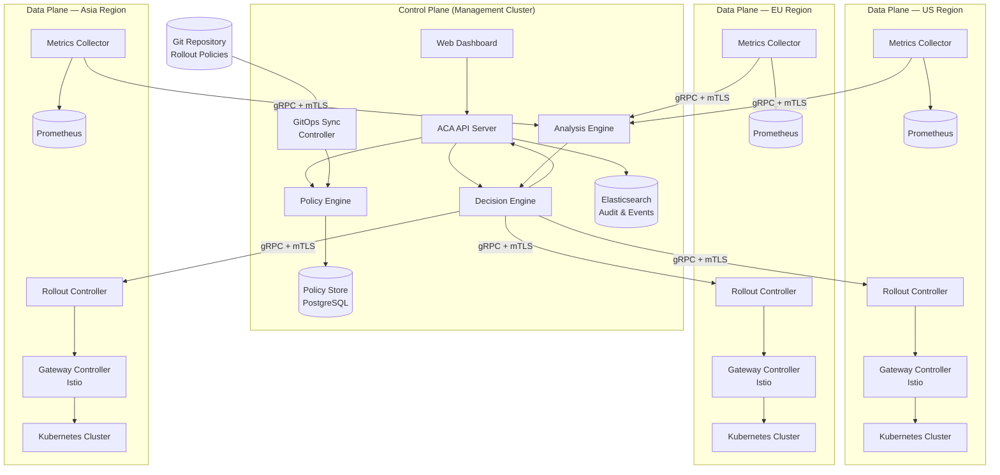
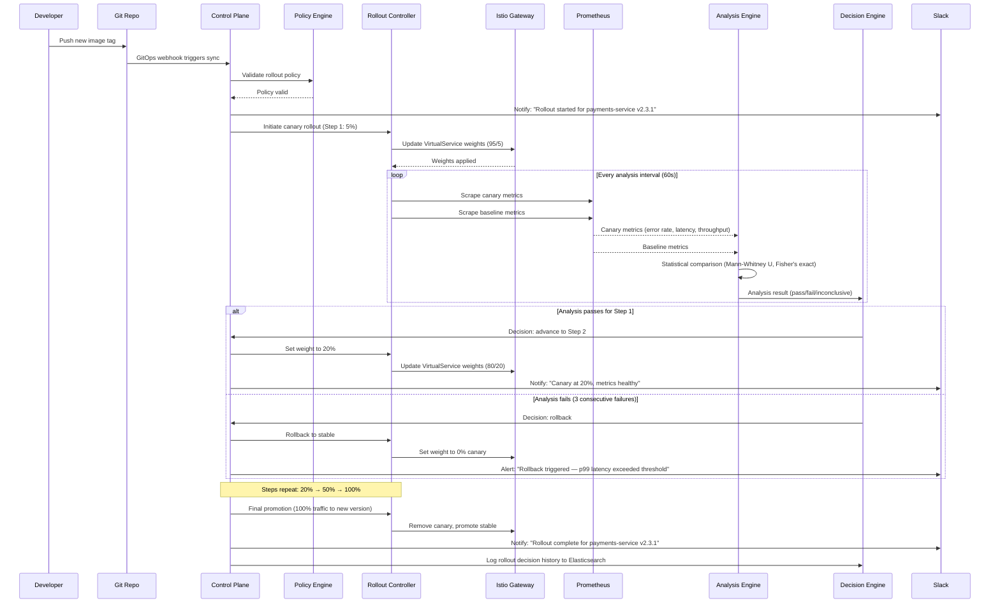
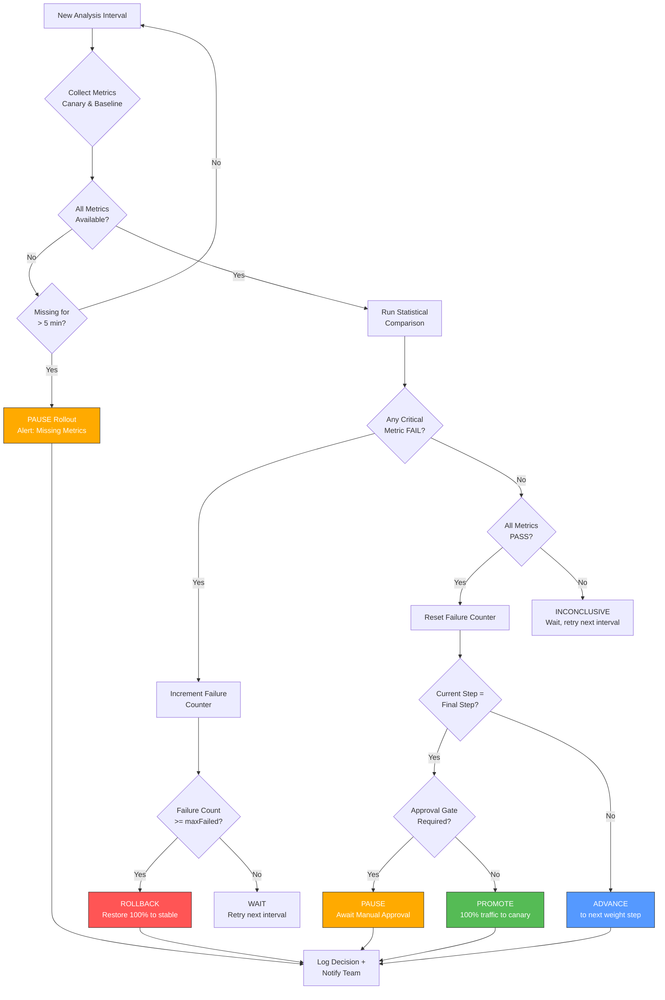
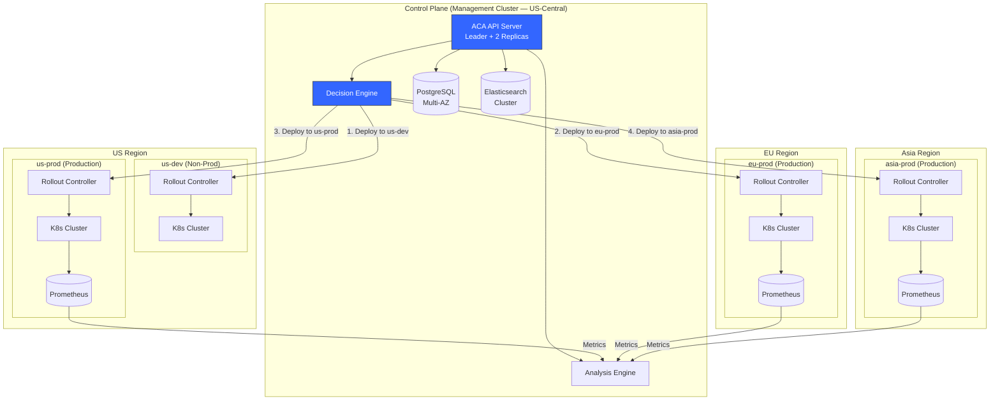

# ACA System Architecture Diagrams

This document contains the key Mermaid diagrams for the Centralized Automated Canary Analysis (ACA) system. Each diagram is accompanied by a brief description of what it illustrates.

---

## 1. High-Level Architecture Diagram

This diagram shows the overall system architecture with the Control Plane (management cluster) and three regional Data Planes. The Control Plane houses the Policy Engine, Analysis Engine, and Decision Engine. Each Data Plane contains a Rollout Controller, Metrics Collector, and Gateway Controller (Istio). Communication between planes uses gRPC with mTLS.

---

## 2. Rollout Sequence Diagram

This diagram traces the lifecycle of a single canary deployment from the developer pushing a new image tag through to either promotion or rollback. It shows how the Control Plane orchestrates the process while the Data Plane executes traffic shifts and metric collection.

---

## 3. Decision Engine Flowchart

This diagram details the logic the Decision Engine follows at each analysis interval. Starting from metric collection, it evaluates metric availability, runs statistical comparisons, and determines the appropriate action: advance, wait, pause, or rollback.

---

## 4. Multi-Region Topology

This diagram shows how deployments flow sequentially across regions (us-dev first, then eu-prod, us-prod, and asia-prod). Each region has its own Rollout Controller and Prometheus instance as independent failure domains. The Control Plane orchestrates the sequence and collects metrics from all regions.

